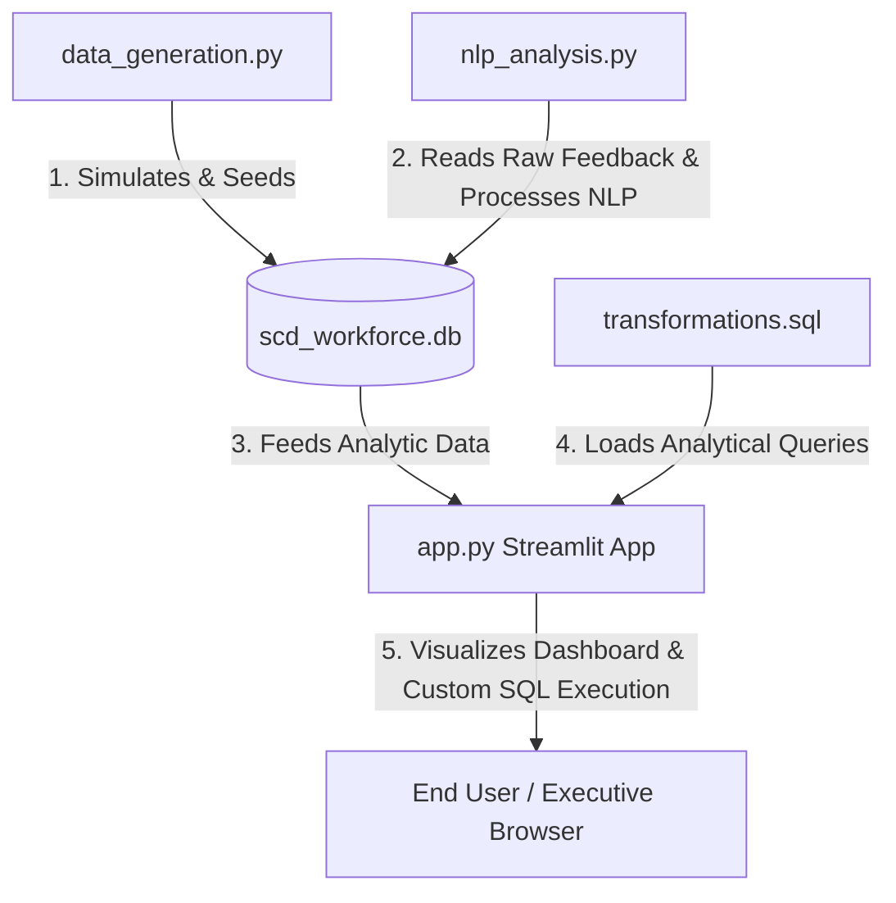

# ◆ SCD Workforce Analytics & Sentiment Engine

An interactive, high-fidelity business intelligence and qualitative analytics platform. This engine processes synthetic employee lifecycle data, models training initiative performance via advanced SQL window metrics, runs a self-contained NLP sentiment pipeline, and features a dynamic Streamlit executive dashboard equipped with semantic guardrails.

---

## 📖 Table of Contents
1. [System Architecture](#-system-architecture)
2. [Database Schema & Data Model](#-database-schema--data-model)
3. [Advanced SQL Analytical Pipelines](#-advanced-sql-analytical-pipelines)
4. [Custom NLP Sentiment & Guardrail Engine](#-custom-nlp-sentiment--guardrail-engine)
5. [Streamlit Dashboard Layout](#-streamlit-dashboard-layout)
6. [Getting Started & Installation](#-getting-started--installation)
7. [Running the System](#-running-the-system)

---

## 🏗️ System Architecture

The project is structured as a self-contained local pipeline bridging data generation, analytical modeling, semantic parsing, and executive visualization:



1. **Ingestion & Simulation (`data_generation.py`)**: Simulates a high-fidelity workforce database of 10,000+ employees and 3,000+ qualitative comments across a 3.5-year span.
2. **NLP Sentiment Pipeline (`nlp_analysis.py`)**: Runs post-generation. Classifies themes, computes custom VADER-like sentiment scores, and flags outlier comments using TF-IDF cosine similarity against an HR reference corpus. Updates findings directly back to SQLite.
3. **Analytical Transformations (`transformations.sql`)**: Core SQL modeling queries defining rolling retention rates, survival cohorts, and dense rankings of training initiative impact.
4. **Presentation Layer (`app.py`)**: A Streamlit application rendering executive visualizations, interactive similarity filtering, tabular metrics, schema inspection, and live SQL querying.

---

## 🗄️ Database Schema & Data Model

The data is stored in a SQLite database (`scd_workforce.db`) and structured as a classic Star/Snowflake schema composed of two dimension tables and two fact tables:

### Dimension Tables

#### `Dim_Department`
Contains information about the organizational structure of Full Sail.
| Column | Type | Constraints | Description |
| :--- | :--- | :--- | :--- |
| `dept_id` | `INTEGER` | Primary Key, Auto-increment | Unique identifier for each department |
| `dept_name` | `TEXT` | Not Null, Unique | Name of the department (e.g. Game Design, IT) |
| `division` | `TEXT` | Not Null | Division category (Academic, Operations, Support) |

#### `Dim_SCD_Program`
Defines professional development programs organized by Staff and Community Development.
| Column | Type | Constraints | Description |
| :--- | :--- | :--- | :--- |
| `program_id` | `INTEGER` | Primary Key, Auto-increment | Unique identifier for each program |
| `program_name` | `TEXT` | Not Null, Unique | Name of the SCD program |
| `program_type` | `TEXT` | Not Null | Program type (Onboarding, Professional Development, Community) |

### Fact Tables

#### `Fact_Employee_Events`
Tracks employee demographic, hire, training completion, performance, and retention status facts.
| Column | Type | Constraints | Description |
| :--- | :--- | :--- | :--- |
| `employee_id` | `INTEGER` | Primary Key, Auto-increment | Unique identifier for each employee |
| `employee_name` | `TEXT` | Not Null | Simulated full name |
| `dept_id` | `INTEGER` | Foreign Key | References `Dim_Department(dept_id)` |
| `hire_date` | `TEXT` | Not Null | Date of hire (`YYYY-MM-DD`) |
| `orientation_completed` | `INTEGER` | Default `0` | Binary indicator (1 = Completed, 0 = Not) |
| `orientation_date` | `TEXT` | Nullable | Date of orientation completion |
| `navigator_school_completed` | `INTEGER` | Default `0` | Binary indicator (1 = Completed, 0 = Not) |
| `navigator_school_date` | `TEXT` | Nullable | Date of Navigator School completion |
| `performance_rating` | `INTEGER` | Check `1` to `5` | Simulated performance review score |
| `retention_status` | `TEXT` | Check `Active`, `Exited` | Employee's retention state |
| `exit_date` | `TEXT` | Nullable | Date of exit (if exited) |

#### `Fact_Sentiment_Feedback`
Stores qualitative survey feedback details along with calculated sentiment and topic classification features.
| Column | Type | Constraints | Description |
| :--- | :--- | :--- | :--- |
| `feedback_id` | `INTEGER` | Primary Key, Auto-increment | Unique identifier for each feedback record |
| `employee_id` | `INTEGER` | Foreign Key, Nullable | References `Fact_Employee_Events(employee_id)` (Null for Glassdoor) |
| `survey_date` | `TEXT` | Not Null | Date of feedback submission |
| `source` | `TEXT` | Check `Glassdoor`, `Internal Survey`, `Exit Interview` | Medium where feedback was submitted |
| `raw_text` | `TEXT` | Not Null | Text submitted by the responder |
| `sentiment_score` | `REAL` | Nullable (Calculated) | Computed polarity score between `-1.00` and `1.00` |
| `sentiment_class` | `TEXT` | Nullable (Calculated) | Categorized rating: `Positive`, `Neutral`, `Negative` |
| `relevance_score` | `REAL` | Nullable (Calculated) | Normalized Cosine Similarity value to HR topics |
| `theme` | `TEXT` | Nullable (Calculated) | Categorized topic theme or `other / outlier` flag |

---

## 📈 Advanced SQL Analytical Pipelines

All major analytics visualizations are driven by SQL query definitions stored inside [`transformations.sql`](file:///c:/Users/Shayara/Downloads/scd/transformations.sql). The dashboard parses and executes these queries against SQLite using Pandas:

### 1. Rolling Orientation Retention (`@name: rolling_retention`)
Calculates rolling 30-day and 90-day retention rates of orientation graduates by month.
* **Mechanism**: Grouping orientation completers by month, calculating the percentage of those who exited within 30 and 90 days.
* **Rolling Metric**: Employs an SQL window function to calculate a 3-month rolling average, mitigating month-over-month noise:
  ```sql
  AVG(retention_rate_90_day) OVER (
      ORDER BY orientation_month 
      ROWS BETWEEN 2 PRECEDING AND CURRENT ROW
  ) AS rolling_3m_retention_90
  ```

### 2. 12-Month Cohort Survival Curves (`@name: cohort_retention`)
Tracks active percentages of hiring cohorts over a 12-month timeline.
* **Mechanism**: Builds survival records by comparing the difference in Julian days between `hire_date` and `exit_date` against intervals (0, 30, 60, 90, 120, 150, 180, 273, and 365 days):
  ```sql
  SUM(CASE WHEN exit_date IS NULL OR (julianday(exit_date) - julianday(hire_date)) >= 365.25 THEN 1 ELSE 0 END) AS m12_retained
  ```
* **Output**: Renders line graphs detailing retention curves to identify critical career drop-off windows.

### 3. Initiative Impact Rankings (`@name: dept_rankings`)
Compares retention rates of employees who completed training initiatives (Orientation or Navigator School) vs those who did not, calculated at the department level.
* **Benefit Metric**: Calculates the retention delta:
  $$\text{Retention Delta} = \text{Trained Retention \%} - \text{Untrained Retention \%}$$
* **Ranking**: Ranks departments using window functions to identify where training programs yield the highest return-on-investment:
  ```sql
  DENSE_RANK() OVER (ORDER BY (trained_retention_rate - untrained_retention_rate) DESC) AS delta_rank
  ```

---

## 🤖 Custom NLP Sentiment & Guardrail Engine

The qualitative tracker ([`nlp_analysis.py`](file:///c:/Users/Shayara/Downloads/scd/nlp_analysis.py)) runs a self-contained NLP engine utilizing machine learning library abstractions without external web calls:

### Semantic Relevance Guardrail (TF-IDF Cosine Similarity)
* **Problem**: Feedback contains noise unrelated to HR policy (e.g., *"cafeteria is open"*, *"lost building badge"*).
* **Solution**: The engine measures how relevant comments are to a defined HR Reference document:
  > `"onboarding orientation navigator school training class schedule course program workshops manager lead director supervisor administrator communication conversation check-in discussion feedback workload schedule stress burnout teaching course prep grading administrative operations compensation pay salary wages benefits hourly rate incentives career development growth promotion"`
* **Algorithm**:
  1. A `TfidfVectorizer` (scikit-learn) fits the corpus of comments alongside the reference document to build sparse vocabulary vectors.
  2. Measures `cosine_similarity` of each comment vector against the reference document.
  3. Normalizes similarities between `0.00` and `1.00`.
  4. In the Streamlit UI, user-defined thresholds (default `0.20`) dynamically filter out low-relevance comments from aggregated metrics. Outliers are visually flagged red in the explorer.

### Sentiment Analysis Polarity Engine
* **Sentiment Rule-based Parser**: Classifies text polarity based on a custom bag-of-words model mimicking VADER. It maps positive lexical cues (e.g. `clear`, `welcoming`, `support`, `fair`, `manageable`) and negative cues (e.g. `disorganized`, `rushed`, `burnout`, `conflict`, `poor`) to compute a compound polarity score:
  $$\text{Compound Score} = \frac{\text{Positive Count} - \text{Negative Count}}{\text{Positive Count} + \text{Negative Count}}$$
  * Scores $\ge 0.05 \rightarrow$ `Positive`
  * Scores $\le -0.05 \rightarrow$ `Negative`
  * Otherwise $\rightarrow$ `Neutral`

---

## 🎨 Streamlit Dashboard Layout

The user interface (configured with custom typography, responsive card grids, and support for light/dark modes) is partitioned into four functional tabs:

1. **📊 Executive Overview**:
   * Top-level numeric KPIs: Active headcount, 90-day retention rate, average sentiment, and total SCD program attendance.
   * Interactive Plotly charts visualizing rolling orientation retention rates and survival curves for hiring cohorts.
   * Tabular divisional breakdowns displaying staff allocations, completion percentages, and average performance ratings.
2. **🎯 Initiative Deep-Dive**:
   * Department-by-department completion metrics for Orientation.
   * Interactive scatter plot comparing Navigator School completion rates against subsequent departmental retention rates.
   * Ranked table mapping trained vs untrained retention ratios and calculated delta benefits.
3. **💬 Qualitative Sentiment Tracker**:
   * Relevance Guardrail Slider: Adjusts the similarity filter threshold dynamically, instantly updating calculations.
   * Monthly sentiment trends plotted alongside vertical markers representing key SCD community events (like *Spring Learn & Grow* workshops).
   * Theme-specific sentiment distribution bars.
   * Full text search interface and color-coded table flagging outlier submissions.
4. **⚙️ SQL & Pipeline Engine**:
   * Code viewers displaying the source queries loaded from `transformations.sql`.
   * Live SQL Console: Executes selected pipeline queries or custom queries directly against the SQLite database, outputting results in dataframes.
   * Schema Inspector: Dynamically runs `PRAGMA table_info` to document tables, keys, and types for developer validation.

---

## 📥 Getting Started & Installation

### Prerequisites
* **Python**: Python 3.9, 3.10, or 3.11 is recommended.
* **SQLite3**: Ships pre-packaged with Python standard libraries.

### Installation
1. Navigate to the project directory:
   ```bash
   # Already in the project directory
   ```
2. Activate the existing virtual environment (`.venv`):
   * **PowerShell**:
     ```powershell
     .venv\Scripts\Activate.ps1
     ```
   * **Command Prompt (cmd)**:
     ```cmd
     .venv\Scripts\activate.bat
     ```
   * **Git Bash / macOS**:
     ```bash
     source .venv/bin/activate
     ```
3. Install package dependencies:
   ```bash
   pip install -r requirements.txt
   ```

---

## 🚀 Running the System

To run the full pipeline or spin up the web dashboard, use the following commands:

### Step 1: Run Data Generator (Optional)
If you want to re-seed or expand the dataset, execute the generation script:
```bash
python data_generation.py
```
*Creates the SQLite database, seeds departmental records, and inserts synthetic employee metrics.*

### Step 2: Run NLP Analysis (Optional)
If you generated a new dataset in the step above, run the NLP pipeline to compute sentiment and relevance:
```bash
python nlp_analysis.py
```
*Fits the TF-IDF model, calculates cosine similarity metrics, scores sentiment, and updates tables inside `scd_workforce.db`.*

### Step 3: Run the Streamlit Dashboard
Launch the web interface locally:
```bash
streamlit run app.py
```
*Streamlit will start a server and print the URLs. By default, it will open `http://localhost:8501` in your browser.*
